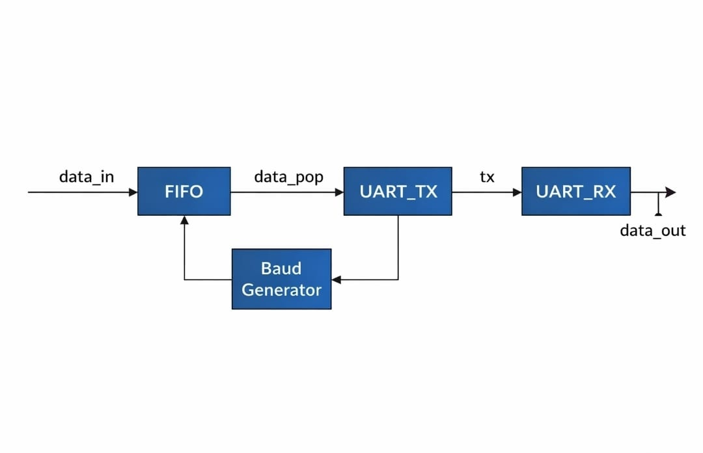
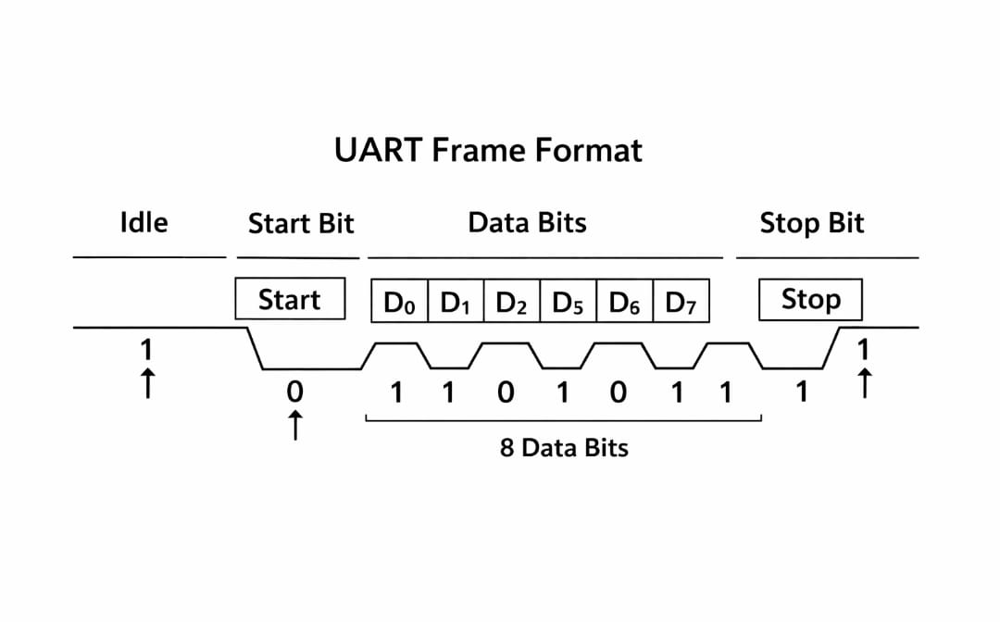
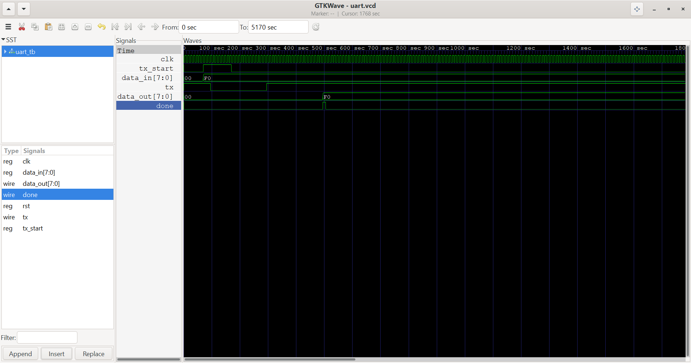
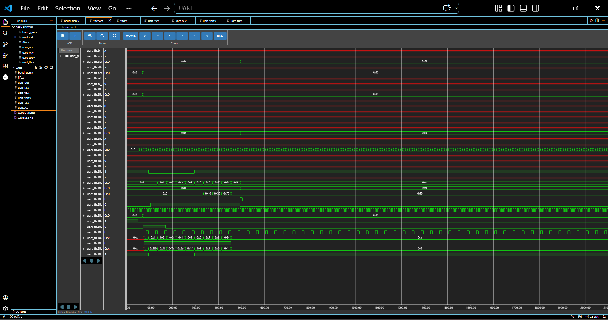

# 🐍 UART Communication Protocol in Verilog

**Author: Anubhav**  

  
  
  
  

---

## 📌 Overview

This project implements a **UART (Universal Asynchronous Receiver/Transmitter)** using Verilog.  
It allows **serial communication** between two devices, transmitting and receiving 8-bit data frames asynchronously.

The design demonstrates **serial-to-parallel and parallel-to-serial data conversion**, along with waveform-based verification of correct communication.

---

## ⚙️ Features

- Asynchronous serial communication (TX/RX)  
- 8-bit data frame with **start and stop bits**  
- Configurable **baud rate**  
- Waveform-based verification for TX and RX  
- Modular and reusable design  

---

## 🧠 UART Architecture

### 🔹 Block Diagram

  
**Explanation:**

- **TX Module:** Converts parallel data to serial data  
- **RX Module:** Converts serial data to parallel data  
- **Baud Rate Generator:** Controls timing for correct bit duration  
- **Registers / Buffers:** Store data before transmission and after reception  

---

### 🔹 UART Frame

  
**Explanation:**

- **Start Bit:** Signals beginning of transmission  
- **Data Bits:** 8 bits of actual data (LSB first)  
- **Stop Bit:** Signals end of transmission  
- Optional **Parity Bit** for error checking (if implemented)  

---

## 📊 Waveform Results

### 🔹 GTKWave Output

  
**Description:**

- Shows TX and RX line activity  
- Data bits transmitted and received correctly  
- Start/Stop bits verified  
- Confirms baud rate timing  

---

### 🔹 VS Code VCD Waveform

  
**Description:**

- Displays signal transitions over time  
- Confirms correct UART frame transmission  
- Matches expected TX/RX behavior  

---

## 📂 File Descriptions & Ports

### 1️⃣ `uart_tx.v` – UART Transmitter
**Purpose:** Converts 8-bit parallel data to serial data for transmission.

**Ports:**
| Port      | Direction   | Description                       |
|-----------|-------------|-----------------------------------|
| clk       | input       | System clock                      |
| rst       | input       | Asynchronous reset                |
| tx_start  | input       | Start transmission signal         |
| data_in   | input [7:0] | 8-bit parallel data to send       |
| tx_serial | output      | Serial data output (TX line)      |
| busy      | output      | High when transmission is ongoing |

---

### 2️⃣ `uart_rx.v` – UART Receiver
**Purpose:** Converts serial input data into 8-bit parallel data.

**Ports:**
| Port       | Direction    | Description                             |
|------------|--------------|-----------------------------------------|
| clk        | input        | System clock                            |
| rst        | input        | Asynchronous reset                      |
| rx_serial  | input        | Serial data input (RX line)             |
| data_out   | output [7:0] | 8-bit parallel received data            |
| rx_done    | output       | High when a full byte has been received |

---

### 3️⃣ `baud_gen.v` – Baud Rate Generator
**Purpose:** Generates timing ticks for UART transmission/reception.

**Ports:**
| Port      | Direction    | Description                   |
|-----------|--------------|-------------------------------|
| clk       | input        | System clock                  |
| rst       | input        | Asynchronous reset            |
| baud_tick | output       | Tick signal at UART baud rate |

---

### 4️⃣ `uart_tb.v` – Testbench
**Purpose:** Simulates UART transmitter and receiver.

**Ports:** *None* (testbench only)

**Functionality:**
- Provides stimulus for `uart_tx` and `uart_rx`  
- Generates clock and reset signals  
- Sends test data to TX module  
- Monitors RX output for correctness  
- Generates VCD waveform for GTKWave visualization  

---

## 🚀 How It Works

1. **Data Input:** Parallel data is given to TX module  
2. **Transmission:** TX converts data to serial format  
3. **Serial Communication:** Bits transmitted over the line at configured baud rate  
4. **Reception:** RX samples incoming bits and reconstructs parallel data  
5. **Output:** Received data is available for verification  

Multiple frames can be transmitted sequentially with correct timing.

---

## ⚠️ Limitations

- No hardware flow control (RTS/CTS)  
- No parity error handling implemented  
- Single baud rate only (can be extended)  

---

## 🏁 Conclusion

This project demonstrates a **fully functional UART module in Verilog**, verified with GTKWave and VCD waveforms.  
It serves as a solid foundation for learning **serial communication** and hardware interface design.

---
